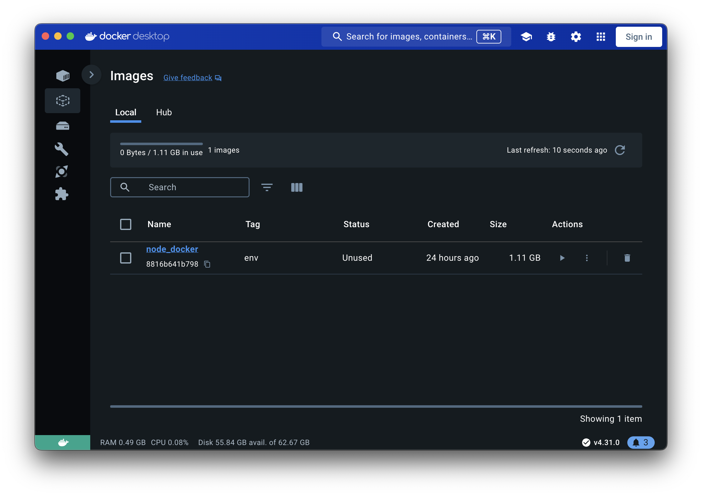
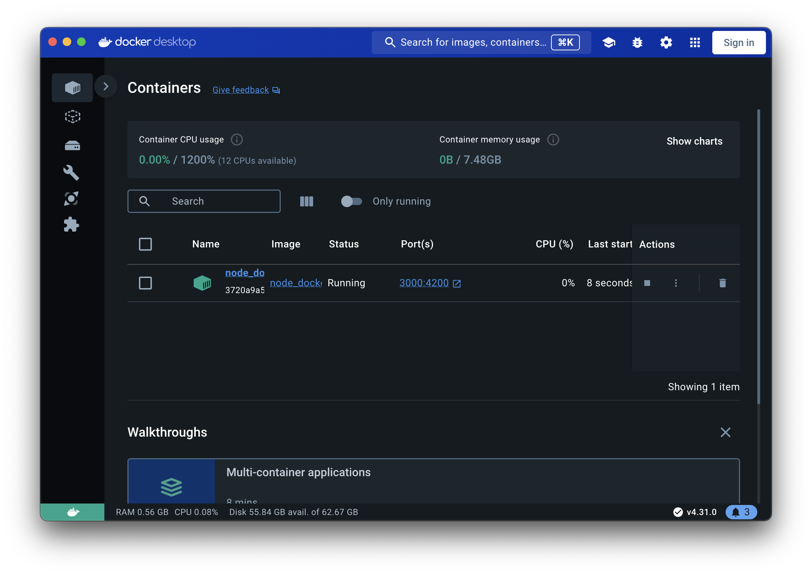
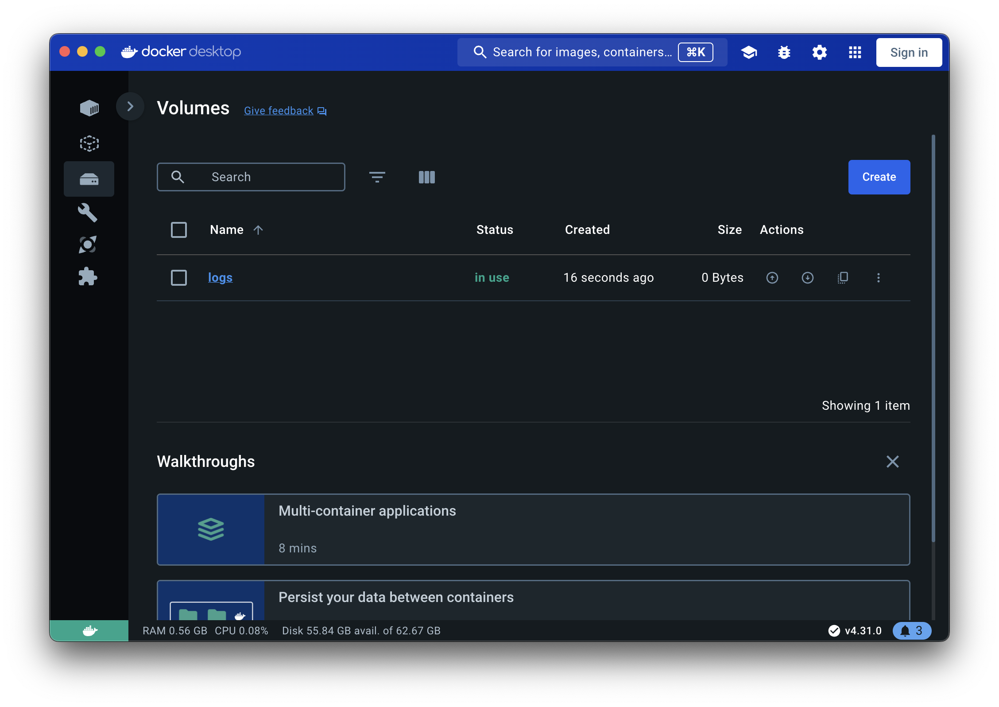
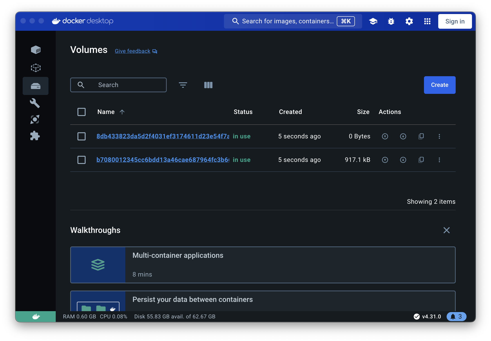

# Educational Docker Project Documentation
#### This project is designed for educational purposes to practice working with Docker. It demonstrates how to set up a Node.js application using Docker, and includes a Makefile for easy management of Docker commands. Below is an explanation of each component in the project.
## Dockerfile
```dockerfile
FROM node
WORKDIR /app
COPY package.json /app
RUN npm install
COPY . .
ENV PORT 4200
EXPOSE $PORT
VOLUME ["/app/data"]
CMD ["node", "main.js"]
```
#### The Dockerfile contains the instructions to build a Docker image for the Node.js application. Here is a breakdown of each command:
```dockerfile
FROM node
```
#### This line specifies the base image for the Docker image. The node image includes Node.js and npm pre-installed.
```dockerfile
WORKDIR /app
```
#### This command sets the working directory inside the container to /app. All subsequent commands will be run in this directory.
```dockerfile
COPY package.json /app
```
#### This line copies the package.json file from the host machine to the /app directory in the container. This file contains the dependencies required for the Node.js application.
```dockerfile
RUN npm install
```
#### This command runs npm install inside the container to install the dependencies listed in the package.json file.
```dockerfile
COPY . .
```
#### This line copies all files from the current directory on the host machine to the /app directory in the container.
```dockerfile
ENV PORT 4200
```
#### This command sets an environment variable PORT inside the container to 4200. The application will use this port to listen for incoming requests.
```dockerfile
EXPOSE $PORT
```
#### This line informs Docker that the container will listen on the specified port (4200). This is used for documentation purposes and doesn't actually publish the port.
```dockerfile
VOLUME ["/app/data"]
```
#### This command creates a volume at /app/data inside the container. Volumes are used to persist data generated by and used by Docker containers.
```dockerfile
CMD ["node", "main.js"]
```
#### This command specifies the default command to run when the container starts. It runs the Node.js application by executing node main.js.

## .dockerignore
```.dockerignore
node_modules
.idea
.git
Dockerfile
```
#### node_modules: This directory contains local Node.js dependencies and should not be included in the Docker image.
#### .idea: This directory contains project-specific settings for IDEs and should be excluded.
#### .git: This directory contains version control data and should be excluded.
#### Dockerfile: Excluding the Dockerfile itself to prevent it from being copied into the image.

## Makefile
```makefile
create_image:
	docker build -t node_docker:env .
run:
	docker run -d -p 3000:4200 -v logs:/app/data --env-file .env --rm --name node_docker node_docker:env
run_dev:
	docker run -d -p 3000:4200 -v $(shell pwd):/app -v /app/node_modules --env-file .env --rm --name node_docker node_docker:env
run_dev_nodemon:
	docker run -d -p 3000:4200 -v $(shell pwd):/app -v /app/node_modules --env-file .env --rm --name node_docker --entrypoint "npx" node_docker:env nodemon main.js
stop:
	docker stop node_docker
```
#### The Makefile defines a set of commands to manage Docker operations. Here is an explanation of each command:
```makefile
create_image:
	docker build -t node_docker:env .
```
#### create_image: This target builds the Docker image with the tag node_docker:env using the Dockerfile in the current directory (.).

```makefile
run:
	docker run -d -p 3000:4200 -v logs:/app/data --env-file .env --rm --name node_docker node_docker:env
```
#### run: This target runs the Docker container in detached mode (-d), mapping port 3000 on the host to port 4200 in the container (-p 3000:4200). It also mounts the logs volume to /app/data inside the container and loads environment variables from the .env file. The container is named node_docker and will be removed automatically when stopped (--rm).


```makefile
run_dev:
	docker run -d -p 3000:4200 -v $(shell pwd):/app -v /app/node_modules --env-file .env --rm --name node_docker node_docker:env
```
#### run_dev: This target runs the Docker container in development mode. It mounts the current directory ($(shell pwd)) to /app inside the container, allowing live editing of files. It also mounts a volume for node_modules to use local dependencies. The rest of the parameters are the same as the run target.


```makefile
run_dev_nodemon:
	docker run -d -p 3000:4200 -v $(shell pwd):/app -v /app/node_modules --env-file .env --rm --name node_docker --entrypoint "npx" node_docker:env nodemon main.js
```
#### run_dev_nodemon: This target runs the Docker container in development mode with nodemon to automatically restart the server on file changes. It overrides the default entry point to use npx nodemon main.js.
```makefile
stop:
	docker stop node_docker
```
#### stop: This target stops the running container named node_docker.
## Working with Volumes
#### Volumes are used to persist data generated by and used by Docker containers. In this project, there are both named and anonymous volumes:
* **-v logs:/app/data**: This command creates a named volume called logs and mounts it to /app/data in the container. This is useful for persisting log data.
* **-v $(shell pwd):/app**: This command mounts the current directory on the host machine to /app in the container. This allows for live editing of files during development.
* **-v /app/node_modules**: This command mounts an anonymous volume for the node_modules directory, preventing local node_modules from being overwritten in the container.
#### These volumes help in managing data and development workflows efficiently, ensuring that changes are reflected immediately and data is persisted as needed.
#### This documentation should provide a comprehensive understanding of how the Dockerfile and Makefile work together to manage the Node.js application in both production and development environments.
